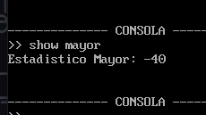

_____

## Manual de usuario 
_____

### menu inicial de opciones al presionar una de esas tres opciones entraremos 

### al presionar uno entraremos al la opcionde cargar archivo en la cual podremos cargar un archivo 

### Al ser correcta la ruta nos premitira usar la consola 

### podemos usar show id , mayo menor , media ,mediana 

### podemos salir con exit y al hacer esto generaremos el reporte de actividades 

### tenemos la opcion de mayo y menor tambien en consola 

### reporte de json

